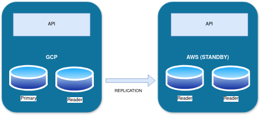
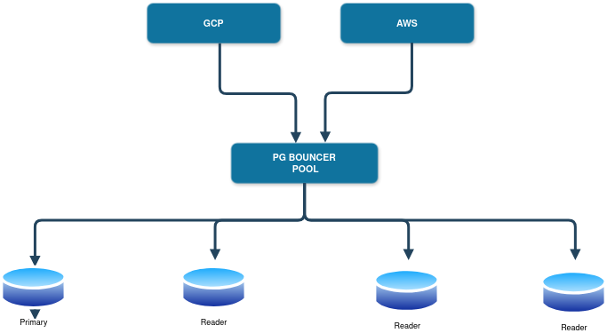

    Which database would you choose?
    How would you manage deployments?
    What approach would you take for backups?
    How would you implement monitoring?
    Identify any potential gray areas that could affect functionality and propose solutions.
    If we want to transition to an active-active scenario, what modifications would be necessary?


Assumptions

- Open source tools, non-propiotary 
- Providing the easiest solution with the least operational overhead

1 - For an entrepise solution I would choose to use Posgresql

Although the exercise does not make any reference about wether the application performs heavy writes or reads worlkloads to the database, the reason of choosing posgresql are its extended capabilities for clustering and replication, since Postgress is based on WAL files, making faster and  more reliable than mysql. Since we are looking for deploying our databases in multiple clouds I believe replication realibility will be paramount to maintain consistency across the stacks.

2 - To deploy a posgresql cluster in kubernetes I would use a helm chart , probably this one 
https://artifacthub.io/packages/helm/bitnami/postgresql.  

For this scenario:

Deploying two Bitnami PostgreSQL clusters:

* Cluster 1 (Active): Primary node and a local secondary replica.

* Cluster 2 (Standby): Primary node and a local secondary replica, configured as a standby of Cluster 1.

Setting up asynchronous replication between Cluster 1 and Cluster 2, where Cluster 2’s primary will act as a read-only standby.



example config:

GCP Cluster:
```
helm install gcp-postgresql-primary bitnami/postgresql \
  --set global.postgresql.auth.postgresPassword=password \
  --set global.postgresql.auth.replicationPassword=passwordreplication \
  --set architecture=replication \
  --set auth.replicationUsername=replicator \
  --set auth.replicationPassword=replicationPassword \
  --set primary.service.type=LoadBalancer
```
Note that in order to make this work we need to expose the kubernetes service as Loadbalancer type, hence this config is needed.
```
--set primary.service.type=LoadBalancer
```
AWS Cluster:
```
helm install aws-postgresql-standby bitnami/postgresql \
  --set global.postgresql.auth.postgresPassword=password \
  --set global.postgresql.auth.replicationPassword=passwordreplicat ion \
  --set architecture=replication \
  --set auth.replicationUsername=replicator \
  --set auth.replicationPassword=replicationPassword \
  --set primary.standby.enabled=true
  --set primary.standby.primaryHost=gcp-postgresql-primary-dns \
  --set primary.standby.primaryPor=5432 \
  --set primary.service.type=LoadBalancer
```
To deploy helm charts into kubernetes I would consider 2 options flux2 or argocd. For this particular
scenario I would vote in favour or argocd due to its support for multitenancy deployments. 
You could deploy the above by using and application set

```
apiVersion: argoproj.io/v1alpha1
kind: ApplicationSet
metadata:
  name: multi-cloud-posgresql-cluster
  namespace: argocd
spec:
  generators:
  - list:
      elements:
        - cluster: gcp
          server: https://gcp-cluster-url    
          values: |
            architecture: replication
            primary
              standby
                enabled: false
          ...

        - cluster: aws
          server: https://aws-cluster-url  
          values: |
            architecture: replication
            primary
              standby
                enabled: true   
            ...
  template:
    metadata:
      name: "{{cluster}}-postgresql-cluster"           # Name will be dynamically set per cluster
    spec:
      project: default
      source:
        repoURL: "bitnami/posgresql"  # URL of your Helm chart repository
        chart: ""        # Name of the Helm chart
        targetRevision: "<chart-version>"   # Version of the Helm chart
      helm:
          values: "{{values}}"    
      destination:
        server: "{{server}}"         # Server URL will be dynamically set per cluster
        namespace: default           # Target namespace for the application
      syncPolicy:
        automated:                   # Optional: Enable auto-sync
          prune: true
          selfHeal: true
```

3 - What approach would you take for backups?
Assuming choosing a solution for scalable backups I would probably use Velero

https://github.com/vmware-tanzu/velero

The advantages of using this approach are the following:

* Open source project with a lot of starts, contributions and recently updated.
* It supports on-prem as well as multiple clouds (Azure, GCP and AWS).
* Scheduled backups.
* Options. Snapshots or filesystem backups
* It is not tied to a specific storage platform.
* It can be easily restore pvc into another cluster, for example restoring prod database into staging environment for troubleshooting and issue
* One tool for all.

4 -The standard approach to monitoring PostgreSQL in Kubernetes is by using its dedicated exporter, developed specifically for this purpose:

https://github.com/prometheus-community/postgres_exporter

This exporter exposes critical metrics like db current/active connections, replication metrics (state, lag) , disk usage, WAL metrics, buffer etc. 
The setup would be very simple, central prometheus or mimir cluster, promtheus operator deployed on each cluster with low retention and remote write to the central cluster for long-term storage. The exporter exposes an endpoint that prometheus will scraped as per the config.

5 - This setup presents the following challenges:

* heavy / writes workloads. This setup only allows one primary that can accepts writes. This mean that writes only allows scale vertically the machine so it there is a limit to where we can reach.  We could potentially address this problem by using sharding.

* Kubernetes installations with a primary/secondary setup do not support failover natively. This means that if the primary node goes offline, the cluster will lose the ability to accept writes until an operator initiates a failover to one of the replicas. Depending on the workload, this can be addressed in two main ways, in my opinion:
1 - With monitoring in place, we can detect when the primary has been down for a certain period and trigger a Kubernetes job or script to perform an automated failover. This approach is acceptable if there is some tolerance for write query failures during the downtime.
2 - If rapid failover is critical to support the business or the cluster is under heavy workloads, a more robust approach is required. In this case, we should consider using the Prometheus operator alongside Patroni. Patroni provides high availability by managing automated failover and leader election. When a primary pod crashes, Patroni detects the failure and orchestrates a failover to a healthy replica within the cluster.

https://github.com/zalando/postgres-operator

Example:
GCP cluster
```
apiVersion: "acid.zalan.do/v1"
kind: postgresql
metadata:
  name: primary-db-cluster
  namespace: default
spec:
  teamId: "team-name"
  volume:
    size: "10Gi"
  numberOfInstances: 2
  users:
    app_user:
      - superuser
      - createdb
  databases:
    app_db: app_user
  postgresql:
    version: "14"
  standby:
    enabled: false
  enableMasterLoadBalancer: true    # Enables external access to the primary service
  enableReplicaLoadBalancer: true   # Enables external access to the replicas
  exposeMasterService: true         # Exposes the master as a service
  exposeReplicaService: true        # Exposes replicas as services
  service:
    type: ClusterIP                 # Set Service type to ClusterIP for internal communication

```
AWS cluster (standby)
```
apiVersion: "acid.zalan.do/v1"
kind: postgresql
metadata:
  name: standby-db-cluster
  namespace: default
spec:
  volume:
    size: "10Gi"
  numberOfInstances: 2
  users:
    app_user:
      - superuser
      - createdb
  databases:
    app_db: app_user
  postgresql:
    version: "14"
  standby:
    enabled: true
    primary_conninfo: "host=<primary-cluster-loadbalancer-ip> port=5432 user=replicator password=<replication-password>"
  enableMasterLoadBalancer: true
  enableReplicaLoadBalancer: true
  exposeMasterService: true
  exposeReplicaService: true
  service:
    type: ClusterIP
```
This setup is significantly more complex and, in my opinion, should be avoided unless there are strong requirements pushing for the implementation of this operator.

Failover would occur within the cluster itself, but failing over the AWS stack would require manual intervention or the execution of an automated process.

6 - Transitioning from active/passive to active/active requires configuring the applications in Stack B to perform writes on the primary database located in the GCP cluster. The standby cluster can still be utilized to handle read queries. To ensure reliability for both clusters, I recommend installing a connection pooler like pgbouncer. This will help load balance connections, allow us to take database units offline for maintenance without causing downtime, and provide additional benefits. If the load increases to the point where a single primary is insufficient, the next step would be to consider sharding the database.




In terms of monitoring no major changes, remote-write to prometheus or mimir instance.